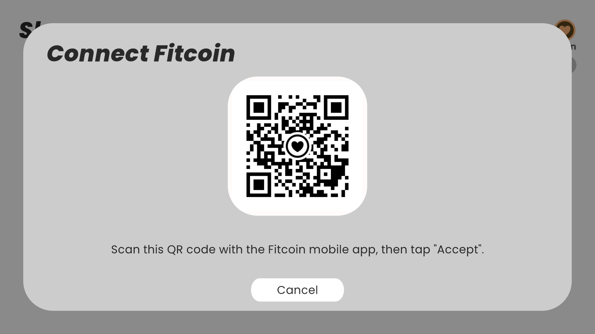
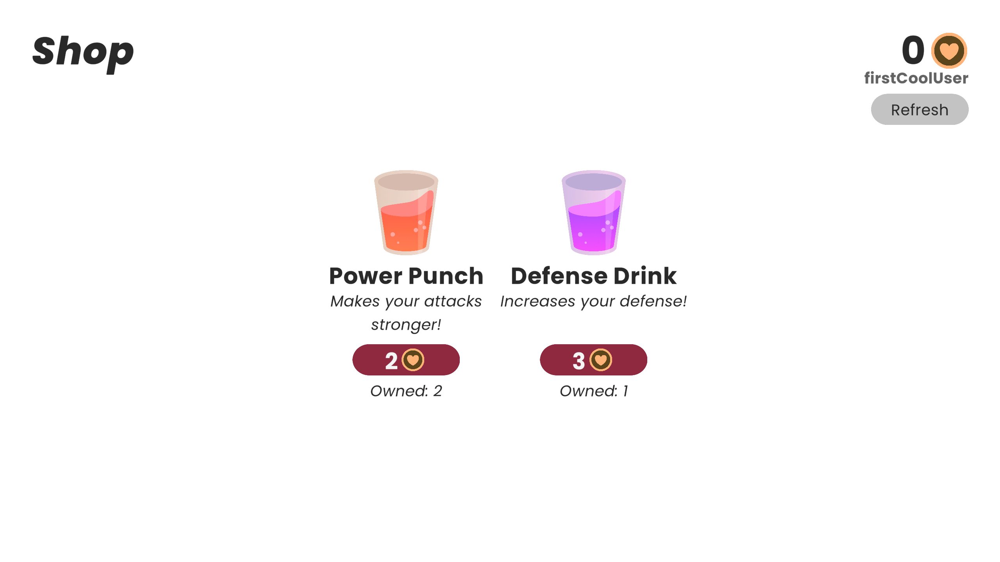
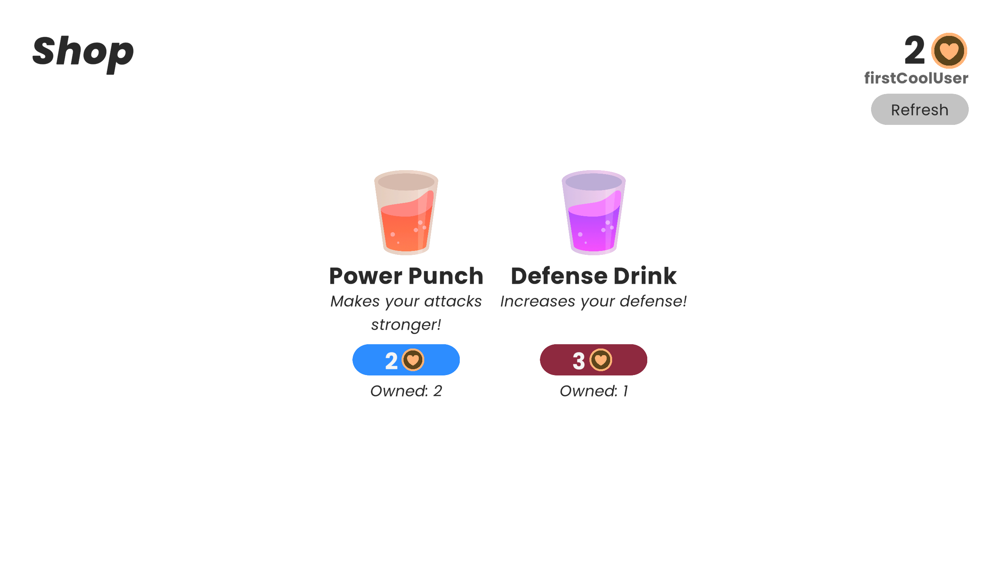

# Fitcoin for Unity Example
This is a small Unity project designed to demonstrate basic usage of the [Fitcoin for Unity API](https://github.com/Meorge/FitcoinUnity).

Users can link their Fitcoin account to this service, then use their Fitcoin to purchase items.

## Requirements
This project requires [DOTween](https://assetstore.unity.com/packages/tools/animation/dotween-hotween-v2-27676), a free asset on the Unity Asset Store.

You may need to pull the `FitcoinUnity` submodule as well.

## Project Setup
All project scripts are stored in the `Assets/Scripts` folder.
- `BalanceDisplay.cs` - UI component for displaying the currently connected user's balance and username
- `Manager.cs` - Contains most of the logic for interfacing with the Fitcoin API